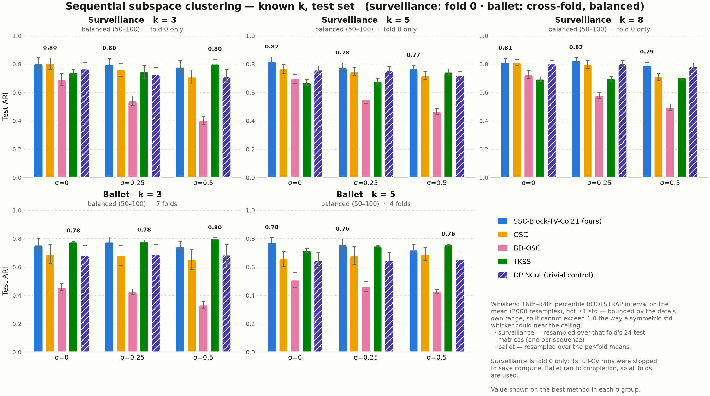

# Sequential Subspace Clustering — reproducible benchmark

A self-contained, inference-first version of the benchmark. It reproduces the
two headline figures from **reported hyperparameters**, so you do not have to
rerun the (expensive) hyperparameter search to check the numbers.



The full method specification — how each `Y` is built, what each method
optimizes, how hyperparameters were selected, and a list of known caveats —
is the parent directory's [`../README.md`](../README.md). This file covers
only how to *run* things. Section references below (§4.3, §8.1, …) point into
that spec.

---

## 1. What is here

```
hyperparameters.csv           the tuned hyperparameters, one row per
                              (dataset, method, k, σ, fold) + reference metrics
results/reference_metrics.csv per-matrix reference values (feeds the figures)
figures/                      the two headline figures (png + pdf)

run_inference.py              evaluate methods from hyperparameters.csv
make_figures.py               render both figures from a per-matrix CSV
verify_reproduction.py        check a run against the reported numbers
build_hyperparameters_csv.py  regenerate the CSVs from the development tree

sscbench/
  config.py                   every load-bearing constant, in one place
  metrics.py                  ARI / NMI / accuracy / noise / normalization
  methods.py                  the five methods + hyperparameter resolution
  data_ballet.py              ballet  → clustering matrices
  data_surveillance.py        surveillance → clustering matrices
  solvers/                    the six solver modules, copied VERBATIM
```

The **raw frames are not copied here** — the package points at
`../surveillance_dataset/{P1E,P1L}` and `../ballet_dataset/frames_tracked`
in place. Override with `SSCBENCH_DATA_ROOT` if you move them.

## 2. Quick start

```bash
conda activate ssc_559        # or: pip install -r requirements.txt

# 1. the figures, straight from the reported reference values (~20 s)
python make_figures.py

# 2. reproduce one cell yourself and check it (~2 min for ballet)
python run_inference.py --dataset ballet --k 3 --sigma 0 --fold 0 \
    --out results/mycheck.csv
python verify_reproduction.py --results results/mycheck.csv --check-solvers

# 3. see what is available without running anything
python run_inference.py --all --list
```

To reproduce everything the CSV reports, `python run_inference.py --all`. That
is hours of CPU; split it with `--dataset` / `--k` / `--sigma` and concatenate
the outputs, or just verify the cells you care about. **Surveillance loads all
24 sequences up front (~1–2 min) and reuses them**, so one job covering many
cells is much cheaper than many single-cell jobs.

### Run it on a compute node, not a login node

Per-matrix solve times recorded by the original runs (from the `seconds`
column) are small — BD-OSC ~5–6 s, everything else under 1 s, so ~1–2 min per
cell. But those numbers come from dedicated SLURM CPUs with BLAS threads
pinned. On a shared login node the same work has been observed running an
order of magnitude slower, and the frame decoding is NFS-bound on top of that.
There is no submit script here on purpose; one small job is all it takes:

```bash
#!/bin/bash
#SBATCH --account=minjilab0 --partition=standard
#SBATCH --time=8:00:00 --mem=32G --cpus-per-task=4
source ~/miniconda3/etc/profile.d/conda.sh && conda activate ssc_559
export OMP_NUM_THREADS=$SLURM_CPUS_PER_TASK MKL_NUM_THREADS=$SLURM_CPUS_PER_TASK
export OPENBLAS_NUM_THREADS=$SLURM_CPUS_PER_TASK PYTHONUNBUFFERED=1
python -u run_inference.py --all --out results/inference_all.csv
```

Results are flushed per row, so a job that hits its walltime still leaves
everything it finished.

## 3. `hyperparameters.csv`

One row per `(dataset, method, k, σ, fold)`. Hyperparameter columns are the
union over methods, so most are blank for any given row:

| columns | used by |
|---|---|
| `block_size`, `lambda_e`, `lambda_z`, `gamma_q` | SSC-Block-TV-Col21 |
| `lambda_1`, `lambda_2` | OSC |
| `lambda_1`, `lambda_2`, `gamma_1`, `p`, `max_iter` | BD-OSC (fixed, never tuned — §4.4) |
| `d`, `lam`, `s` | TKSS |
| *(none)* | DP NCut (trivial control) |

plus `n_test_matrices`, `ref_test_ari`, `ref_test_acc` (what a correct
reproduction should return), `source_file`, and `notes`.

**`block_size` is not `k`.** `block_size` is the total-variation window; `k` is
the number of clusters. They are independent, and setting `block_size = k`
switches off the very term that distinguishes the proposed method (§4.3), so
`methods.py` requires it explicitly and never defaults it.

### Fold coverage, and why it differs by dataset

* **ballet — all folds** (7 at k=3, 4 at k=5, leave-one-dancer-out). Those
  jobs ran to completion.
* **surveillance — fold 0 only.** The full-CV surveillance runs were stopped
  part-way to save compute, so cells have differing fold coverage. Fold 0 is
  present in every cell, so restricting to it keeps all five methods
  comparable on identical data.

### Read the `notes` column

Two groups of rows carry caveats, recorded rather than smoothed over:

1. **surveillance Col21 at k=8** was run at `lambda_e=0.1`, before the pin was
   unified to `0.01` (§8.2). Measured cost is ~0.0003 ARI, but it is not the
   documented procedure. A `lambda_e=0.01` fold-0 replacement exists in the
   development tree's quarantine directory; it was **not** substituted here,
   because these are the values that produced the plotted numbers.
2. **surveillance Col21 at k=8** also uses `block_size=3`. The
   block-size-searched probe (§7e) later showed `2` beats `3` at k=8 at every
   σ, so this pin should become a uniform `2` on the next rerun.

**All nine surveillance TKSS cells now use the widened `d` grid**
`{1,4,8,11,15,25,40,60}` — as of 2026-09-10, k=8 σ∈{0, 0.25} no longer fall
back to the narrower grid. Those two cells' original widened-`d` rerun was
cancelled before writing fold 0; rather than repeat the full (expensive,
~8h/cell) job, they were **backfilled** with a dedicated `--only-fold 0` job
each (d=25 and d=4 respectively). `build_hyperparameters_csv.py` prefers this
backfill (`K8_BACKFILL`, a sibling of the quarantine directory) over the
quarantine's empty file for those two cells specifically; every other cell is
unaffected. The `notes` column records the backfill provenance rather than
hiding it, and the figures' `narrow d` stamp — driven from this same column —
is gone because there is nothing left for it to flag.

## 4. Regenerating the CSV after new jobs land

`build_hyperparameters_csv.py` is the only script that reads the development
tree (`../block_ssc_benchmark/cv/`). When queued jobs finish:

```bash
python build_hyperparameters_csv.py      # rewrites hyperparameters.csv
                                         #    + results/reference_metrics.csv
python make_figures.py                   # re-renders both figures
```

It refuses to guess: if two non-backup CSVs match a cell's glob it errors out
naming both, rather than silently picking whichever the filesystem returned
first. It also errors if one cell's rows disagree on hyperparameters, which is
the fingerprint of a half-overwritten file.

## 5. What was left out, and why

This package is deliberately smaller than the development tree:

* **No Optuna / TPE.** Grid search is deterministic and is what the reported
  results used; the TPE path only reproduced superseded generations.
* **No SLURM plumbing.** ~200 generated job scripts and 6 submit scripts
  collapse to `run_inference.py`'s CLI flags.
* **No tuning code.** Reproducing the *reported* results needs the selected
  hyperparameters, not the search that found them. The search is specified in
  §4.2 and lives in the development tree if you need to rerun it.
* **No ablations** (`SSC-Block-TV`, `SSC-Block-TV-L1`), no `--hetero-noise`,
  no `k`-estimation path (`k` is known everywhere here), and none of the
  `cv_imbalance` / `cv_blocksearch` variant trees. (`cv_tkss_k8_widened` is the
  one exception: `build_hyperparameters_csv.py` reads two specific files from
  it — the k=8, σ∈{0,0.25} TKSS backfill — see §3's `notes`-column entry.)
* **One copy of everything.** The tree carried two ~1500-line near-duplicate
  `cluster_experiment.py` files that had already drifted apart — §8.1 was a bug
  living in one copy and not the other. The shared parts are extracted here.

### Two deliberate changes from the development tree

1. **Accuracy uses `scipy.optimize.linear_sum_assignment`** instead of the
   tree's from-scratch Hungarian, which had a `if not found: break` path that
   could return a partial assignment (§8.8). It validated clean against scipy
   over 300 random label pairs, so no reported number changes.
2. **The solvers are byte-identical copies.** `sscbench/solvers/` is not
   refactored — it is the numerical core, and an unmodified copy is the only
   version provably matching the published numbers. `verify_reproduction.py
   --check-solvers` md5-compares all six against the originals.

Everything else — the RNG seeding, the fold construction, the frame sampling,
the noise model, the ARI/NMI formulas — is reproduced exactly. Verified
per-matrix, not just per-cell: see §6.

## 6. Verification status

| check | result |
|---|---|
| solver copies byte-identical to originals | ✅ all 6 |
| ARI / NMI vs scikit-learn, 300 random label pairs | ✅ 0 mismatches |
| surveillance fold-0 groups vs run logs, k=3/5/8 | ✅ identical |
| ballet segment inventory + fold eligibility vs spec | ✅ identical |
| ballet k=3 σ=0 fold 0, per-matrix ARI/ACC/frames/segments | ✅ exact to 6 dp |
| figure bootstrap intervals satisfy `0 ≤ lo ≤ mean ≤ hi ≤ 1` | ✅ all cells |

Reproducing a single fold works *without replaying the others* because the
seeding is deliberately fold-independent — ballet seeds frame sampling and
noise from the dancer id alone, surveillance shares one noisy `Y` per sequence
across folds. That property was a bug fix (§8.8), and it is what makes
per-cell verification meaningful here.

## 7. Reading the figures

* **Bars are anchored at 0** over the metric's full `[0, 1]` range.
* **Whiskers are a 16th–84th percentile bootstrap interval on the mean**
  (2000 resamples), not ±1 std. ARI and accuracy are bounded above by 1.0, and
  a symmetric std whisker near that ceiling can extend past it. A bootstrap
  resample only contains values already in the sample, so the interval can
  never leave the data's range. It is a CI on the *mean*, hence visibly
  tighter than a spread-of-observations whisker.
* **The whiskers mean different things in the two rows**, which is why they
  are labelled per row: surveillance resamples fold 0's 24 test matrices (one
  per sequence); ballet resamples the per-fold means.
* **`DP NCut (trivial)` is a floor, not a competitor.** It has no
  self-expression step and no hyperparameters. Whatever a real method achieves
  above it is what the subspace model actually bought — and it lands closer
  than is comfortable (§8.5).
* ARI and accuracy **can disagree on which method wins a cell** (e.g. ballet
  k=5, σ=0.25), so both figures are reported rather than whichever is kinder.
